# Segmentation Guided Medical Image Generation using Diffusion

This is the main repository for our work on the WS24 master practical course `Applied Deep Learning in Medicine (IN2106, IN4314)`. 

Topic: **Image Translation and Generation with Latent Diffusion**

## Structure
```
/vol/miltank/projects/practical_WS2425/diffusion/
├── code (this repository)
│   ├── amos_segmentator                : Unet based 2D segmenation model for amos data 
│   ├── eda                             : Exploratory Data Analysis
│   ├── evaluation                      : Scripts for evaluating image generations
│   ├── segmenttation-guided-diffusion  : Diff-Moddel for seg guided image generation                 
│   ├── utils                           : Utility functions
│   │   ├── dataset                     : Data related code
│   │   │   ├── amos.py                 : Custom dataset for amos data 
│   │   │   ├── custom.py               : Custom dataset for any image folder
│   │   │   ├── transforms.py           : Custom transforms for image-label pairs       
│   │   ├── filter_mask                 : Script for filtering images
│   │   ├── slicing                     : Script for slicing nifti images
│   │   └── utils.py                    : Misc Utility functions
│   └── vqvae                           : VQ-VAE model for image and mask embedding
└── data                                
    ├── amos22                          : Amos22 nifti
    ├── amos_robert                     : Amos TotalVibeSegmentor nifti
    ├── amos_robert_embeddings          : VQ-VAE embeddings
    ├── amos_robert_slices              : Slices of amos data, axial, coronal, sagittal
    ├── amos_slices                     : Slices of amos data, axial, coronal, sagittal
    └── test_data                       : Small datasubset for experimenting
```

## Description
Previous work mostly focused on segmentation of medical images. The annotation of different structures in medical images, which is a crucial step in medical image analysis. Many deep learning structures exist to successfully automate this process.

The goal of this project is to leverage modern duffusion architecture and now highly available annotations to reverse above process and generate medical images from segmentation masks. Herefor we use a generative diffusion model which reverse process is conditioned on or guided by the segmentation masks.

This project is adapted to work with the [amos22](https://amos22.grand-challenge.org/) dataset combined with enhanced segmentations of up to 72 different classes created using [TotalVibeSegmentor](https://github.com/robert-graf/TotalVibeSegmentator).

Further details can be found in the [project report](./report.pdf).

## Installation
To install the required environment, run `pip install -r requirements.txt`.

## Usage
Each folder contains names python scripts for the respective task. For more complex script calls, a bash script with default parameters is provided.

Example workflow:

1. Sampling segmentation guided images
    ```bash
    cd code/segmentation-guided-diffusion
    bash scripts/inf_ct_all_axis.sh
    ```

    This will load the amos slices test dataset and create a folder in `code/evaluation` containing the origianl images and segmentations as well as the generated images.

2. Adding segmentations to generated images
    ```bash
    cd code/amos_segmentator
    bash inference.sh
    ```

    This will add segmentation masks to the generated and original images.

3. Evaluation of generated images
    ```bash
    cd code/evaluation
    bash run.sh
    ```

    This will calculate SSIM, PSNR, FID, and Dice scores for the generated images.
    Note: The Dice score will be evauated twice: between original masks and the generated masks on the original and generated images.
    The first score accounts for validity of the segmentator to be used as a metric.

4. Additional sampling
    ```bash
    cd code/segmentation-guided-diffusion
    bash scripts/inf_multi_ct_all_axis.sh
    bash scripts/inf_ct_all_axis_on_mri.sh
    ```

    Two additional scripts for
    - sampling multiple variants for the same label
    - using different trained models on different data modes 
        e.g. use a CT trained model on MRI segmentations for MRI to CT translation

## Showcase

### Segmentation Guided Diffusion Samples
Original, Segmentation, Generated


[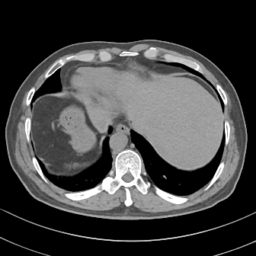]()
[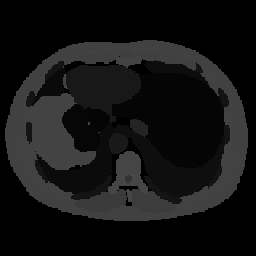]()
[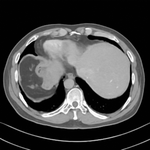]()

[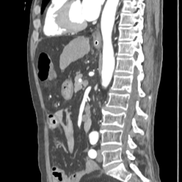]()
[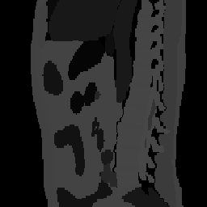]()
[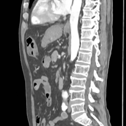]()

[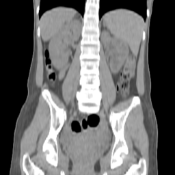]()
[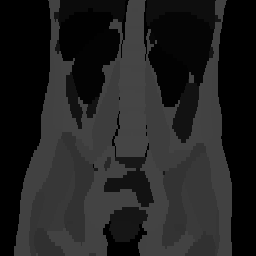]()
[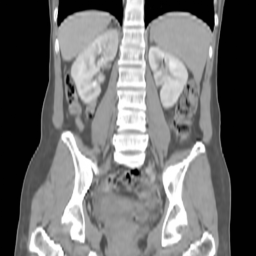]()


### Multi Inference
Original, Segmentation, Generated

[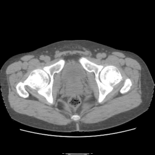]()
[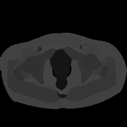]()

[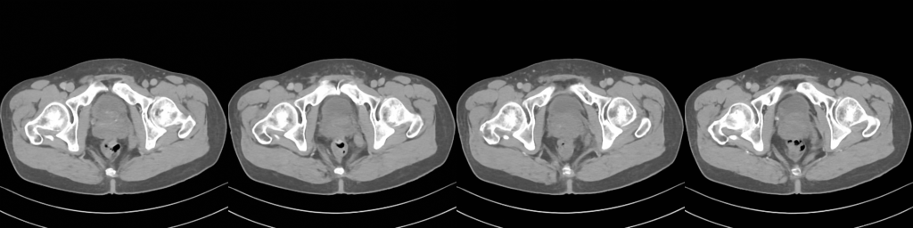]()

### MRI to CT Translation
Original (MRI), Segmentation, Generated (CT)

[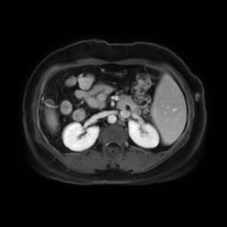]()
[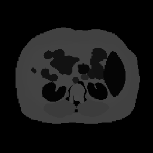]()
[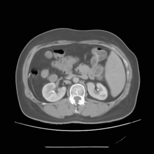]()

[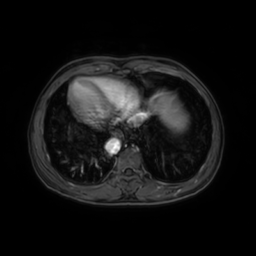]()
[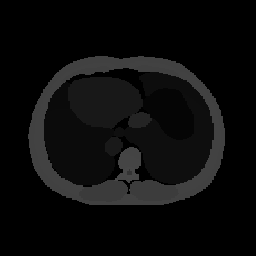]()
[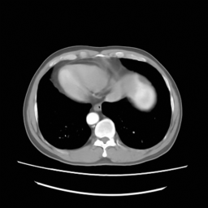]()


